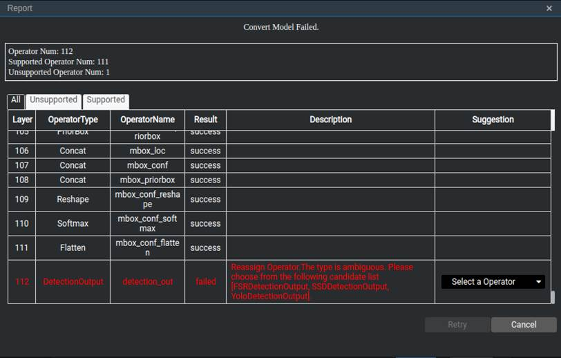

# 活体检测

开发者可以将本application部署至Atlas 200DK上实现对摄像头数据的实时采集检测是否为真人功能。

当前分支中的应用适配**1.1.1.0**与**1.3.0.0**版本的[DDK&RunTime](https://ascend.huawei.com/resources)。

## 前提条件

部署此Sample前，需要准备好以下环境：

-   已完成Mind Studio的安装。
-   已完成Atlas 200 DK开发者板与Mind Studio的连接，交叉编译器的安装，SD卡的制作及基本信息的配置等。

## 软件准备

运行此Sample前，需要按照此章节进行相关的环境配置并获取源码包、准备模型文件。

1.  以Mind Studio安装用户登录Mind Studio所在Ubuntu服务器，并设置环境变量。

    **vim \~/.bashrc**

    执行如下命令在最后一行添加DDK\_HOME及LD\_LIBRARY\_PATH的环境变量。

    **export DDK\_HOME=$HOME/tools/che/ddk/ddk**

    **export LD\_LIBRARY\_PATH=$DDK\_HOME/uihost/lib**

    > **说明：**    
    >-   如果此环境变量已经添加，则此步骤可跳过。  

    输入:wq!保存退出。

    执行如下命令使环境变量生效。

    **source \~/.bashrc**

2.  获取源码包。

    将[https://github.com/Atlas200dk/sample-faceantispoofing](https://github.com/Atlas200dk/sample-faceantispoofing)仓中的代码以Mind Studio安装用户下载至Mind Studio所在Ubuntu服务器的任意目录，例如代码存放路径为：$HOME/sample-faceantispoofing。

3.  获取此应用中所需要的原始网络模型。

    参考[表1](#table144841813177)获取此应用中所用到的原始网络模型及其对应的权重文件，并将其存放到Mind Studio所在Ubuntu服务器的任意目录，例如：$HOME/ascend/models/faceantispoofing。

    **表 1**  Face Antispoofing中使用模型

    
    <table><thead align="left"><tr id="row161061318181712"><th class="cellrowborder" valign="top" width="13.61%" id="mcps1.2.4.1.1">
模型名称

    </th>
    <th class="cellrowborder" valign="top" width="10.03%" id="mcps1.2.4.1.2">
模型说明

    </th>
    <th class="cellrowborder" valign="top" width="76.36%" id="mcps1.2.4.1.3">
模型下载路径

    </th>
    </tr>
    </thead>
    <tbody><tr id="row1710661814171"><td class="cellrowborder" valign="top" width="13.61%" headers="mcps1.2.4.1.1 ">
face_detection

    </td>
    <td class="cellrowborder" valign="top" width="10.03%" headers="mcps1.2.4.1.2 ">
人脸检测网络模型。

    
此模型是基于Caffe的Resnet10-SSD300模型转换后的网络模型。

    </td>
    <td class="cellrowborder" valign="top" width="76.36%" headers="mcps1.2.4.1.3 ">
请参考<a href="https://github.com/Ascend-Huawei/models/tree/master/computer_vision/object_detect/face_detection" target="_blank" rel="noopener noreferrer">https://github.com/Ascend-Huawei/models/tree/master/computer_vision/object_detect/face_detection</a>目录中README.md下载原始网络模型文件及其对应的权重文件。

    </td>
    </tr>
    <tr id="row1121155321119"><td class="cellrowborder" valign="top" width="13.61%" headers="mcps1.2.4.1.1 ">
depl

    </td>
    <td class="cellrowborder" valign="top" width="10.03%" headers="mcps1.2.4.1.2 ">
面部特征点网络模型。此模型是基于Caffe的VGG-SSD模型转换后的网络模型

    </td>
    <td class="cellrowborder" valign="top" width="76.36%" headers="mcps1.2.4.1.3 ">
请参考<a href="https://github.com/Ascend-Huawei/models/tree/master/computer_vision/object_detect/head_pose_estimation" target="_blank" rel="noopener noreferrer">https://github.com/Ascend-Huawei/models/tree/master/computer_vision/object_detect/head_pose_estimation</a>目录中README.md下载原始网络模型文件及其对应的权重文件。

    </td>
    </tr>
    </tbody>
    </table>

4.  将原始网络模型转换为适配昇腾AI处理器的模型。
    1.  在Mind Studio操作界面的顶部菜单栏中选择“Tool \> Convert Model”，进入模型转换界面。
    2.  在弹出的**Convert Model**操作界面中，Model File与Weight File分别选择[步骤3](#li1365682471610)中下载的模型文件和权重文件。
        -   Model Name填写为[表1](#table144841813177)中的模型名称。
        -   depl模型转换时需要关闭AIPP。
        -   其他参数保持默认值。

    3.  单击“OK“开始模型转换。

        face\_detection模型转换时，会出现如下报错信息。

        **图 1**  模型转换错误  
        

        

        此时在DetectionOutput层的Suggestion中选择**SSDDetectionOutput**，并点击**Retry**。

        模型转换成功后，转换好的后缀为.om的模型文件存放地址为：$HOME/tools/che/model-zoo/my-model/xxx。

5.  将转换好的模型文件（.om文件）上传到[步骤2](#li953280133816)中源码所在路径下的“sample-faceantispoofing/script”目录下。

## 部署

1.  以Mind Studio安装用户进入sample-faceantispoofing应用代码所在根目录，如：$HOME/sample-faceantispoofing。
2.  执行部署脚本，进行工程环境准备，包括ascenddk公共库的编译与部署、Presenter Server服务器的配置等操作，其中Presenter Server用于接收Application发送过来的数据并通过浏览器进行结果展示。

    **bash deploy.sh** _host\_ip_ _model\_mode_

    -   _host\_ip_：Atlas 200 DK开发者板的IP地址。
    -   model\_mode代表模型文件及依赖软件的部署方式，默认为internet。
        -   **local**：若Mind Studio所在Ubuntu系统未连接网络，请使用local模式，执行此命令前，需要参考[依赖代码库下载](#section4995103618210)将依赖的公共代码库下载到“sample-faceantispoofing/script“目录下。
        -   **internet**：若Mind Studio所在Ubuntu系统已连接网络，请使用internet模式，在线下载依赖代码库。

    命令示例：

    **bash deploy.sh 192.168.1.2 internet**

    当提示“Please choose one to show the presenter in browser\(default: 127.0.0.1\):“时，请输入在浏览器中访问Presenter Server服务所使用的IP地址（一般为访问Mind Studio的IP地址。）

    并在“Current environment valid ip list“中选择通过浏览器访问Presenter Server服务使用的IP地址。

3.  启动Presenter Server。

    执行如下命令在后台启动faceantispoofing应用的Presenter Server主程序。

    **bash start\_prensenterserver.sh**

    登录Presenter Server，仅支持Chrome浏览器。IP地址为[步骤2](#li9634105881418)中输入的IP地址，端口号默为7007，如下图所示，表示Presenter Server启动成功。

    **图 2**  主页显示  
    

    Presenter Server、Mind Studio与Atlas 200 DK之间通信使用的IP地址示例如下图所示：

    **图 3**  IP地址示例  
    

    其中：

    -   Atlas 200 DK开发者板使用的IP地址为192.168.1.2（USB方式连接）。
    -   Presenter Server与Atlas 200 DK通信的IP地址为UI Host服务器中与Atlas 200 DK在同一网段的IP地址，例如：192.168.1.223。
    -   通过浏览器访问Presenter Server的IP地址本示例为：10.10.0.1，由于Presenter Server与Mind Studio部署在同一服务器，此IP地址也为通过浏览器访问Mind Studio的IP。

## 运行

1.  运行**faceantispoofing**程序。

    在**sample-faceantispoofing**目录下执行如下命令运行faceantispoofing应用程序。

    **bash run\_biopsyapp.sh** _host\_ip_ _presenter\_view\_app\_name  camera\_channel\_name_   &

    -   _host\_ip_：对于Atlas 200 DK开发者板，即为开发者板的IP地址。
    -   _presenter\_view\_app\_name_：用户自定义的在PresenterServer界面展示的View Name，此View Name需要在Presenter Server展示界面唯一，只能为大小写字母、数字、“/”的组合，位数至少1位。
    -   _camera\_channel\_name_：摄像头所属Channel，取值为“Channel-1“或者“Channel-2“，查询摄像头所属Channel的方法请参考[Atlas 200 DK使用指南](https://ascend.huawei.com/documentation)中的“如何查看摄像头所属Channel”。

    命令示例：

    **bash run\_biopsyapp.sh 192.168.1.2 video Channel-1 &**

2.  使用启动Presenter Server服务时提示的URL登录 Presenter Server 网站。

    等待Presenter Agent传输数据给服务端，单击“Refresh“刷新，当有数据时相应的Channel 的Status变成绿色，如[图4](#fig113691556202312)所示。

    **图 4**  Presenter Server界面  
    

    > **说明：**   
    >-   faceantispoofing的Presenter Server最多支持10路Channel同时显示，每个  _presenter\_view\_app\_name_  对应一路Channel。  
    >-   由于硬件的限制，每一路支持的最大帧率是20fps，受限于网络带宽的影响，帧率会自动适配为较低的帧率进行展示。  

3.  单击右侧对应的View Name链接，比如上图的“video”，查看结果。

## 后续处理

-   **停止faceantispoofing应用**

    faceantispoofing应用执行后会处于持续运行状态，若要停止faceantispoofing应用程序，可执行如下操作。

    以Mind Studio安装用户在$HOME/sample-faceantispoofing目录下执行如下命令：

    **bash stop\_biopsyapp.sh** _host\_ip_

    _host\_ip_：对于Atlas 200 DK开发者板，即为开发者板的IP地址。。

    命令示例：

    **bash stop\_biopsyapp.sh 192.168.1.2**

-   **停止Presenter Server服务**

    **bash stop\_prensenterserver.sh**

## 依赖代码库下载

将依赖的软件库下载到“sample-faceantispoofing/script“目录下。

**表 2**  依赖代码库下载

<table><thead align="left"><tr id="row1949214345587"><th class="cellrowborder" valign="top" width="33.33333333333333%" id="mcps1.2.4.1.1">
模块名称

</th>
<th class="cellrowborder" valign="top" width="33.33333333333333%" id="mcps1.2.4.1.2">
模块描述

</th>
<th class="cellrowborder" valign="top" width="33.33333333333333%" id="mcps1.2.4.1.3">
下载地址

</th>
</tr>
</thead>
<tbody><tr id="row449315344589"><td class="cellrowborder" valign="top" width="33.33333333333333%" headers="mcps1.2.4.1.1 ">
EZDVPP

</td>
<td class="cellrowborder" valign="top" width="33.33333333333333%" headers="mcps1.2.4.1.2 ">
对DVPP接口进行了封装，提供对图片/视频的处理能力。

</td>
<td class="cellrowborder" valign="top" width="33.33333333333333%" headers="mcps1.2.4.1.3 ">
<a href="https://github.com/Atlas200dk/sdk-ezdvpp" target="_blank" rel="noopener noreferrer">https://github.com/Atlas200dk/sdk-ezdvpp</a>

下载后请保持文件夹名称为ezdvpp。

</td>
</tr>
<tr id="row134936341585"><td class="cellrowborder" valign="top" width="33.33333333333333%" headers="mcps1.2.4.1.1 ">
Presenter Agent

</td>
<td class="cellrowborder" valign="top" width="33.33333333333333%" headers="mcps1.2.4.1.2 ">
与Presenter Server进行交互的API接口。

</td>
<td class="cellrowborder" valign="top" width="33.33333333333333%" headers="mcps1.2.4.1.3 ">
<a href="https://github.com/Atlas200dk/sdk-presenter/tree/master" target="_blank" rel="noopener noreferrer">https://github.com/Atlas200dk/sdk-presenter/tree/master</a>

请获取此路径下的presenteragent文件夹，下载后请保持文件夹名称为presenteragent。

</td>
</tr>
<tr id="row2049413455810"><td class="cellrowborder" valign="top" width="33.33333333333333%" headers="mcps1.2.4.1.1 ">
tornado (5.1.0)

protobuf (3.5.1)

numpy (1.14.2)

</td>
<td class="cellrowborder" valign="top" width="33.33333333333333%" headers="mcps1.2.4.1.2 ">
Presenter Server依赖的Python库

</td>
<td class="cellrowborder" valign="top" width="33.33333333333333%" headers="mcps1.2.4.1.3 ">
可以在python官网<a href="https://pypi.org/" target="_blank" rel="noopener noreferrer">https://pypi.org/</a>上搜索相关包进行安装。

若使用pip3 install命令在线下载，可以使用如下命令指定相关版本进行下载，例如：

pip3 install tornado==5.1.0  -i  <em id="i12494113495819">指定库的安装源</em>  --trusted-host  <em id="i8494153413586">安装源的主机名</em>

</td>
</tr>
</tbody>
</table>

